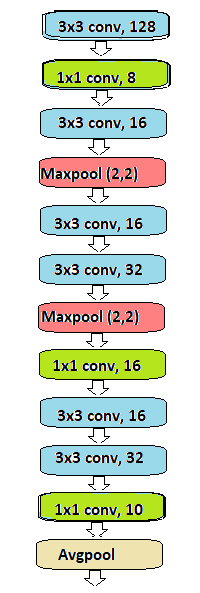
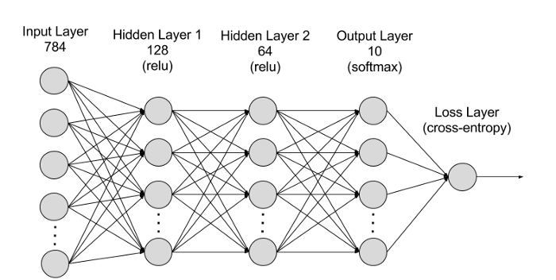

# CNN/DNN Digit Recognition

## Published

[Veröffentlichte Applikation](https://share.streamlit.io/scuba14/digit-recognition/app.py) 

## Installation

Use Pipenv:

```pipenv install```

Use pip:

```pip install -r requirements.txt```

## Jupyter Notebook CNN


  A jupyter notebook for training a convolutional neural network (CNN) on the MNIST dataset
 
  * Accuaracy: 99% on random test data from the MNIST dataset 
  * A visualisation of the Loss-Function over the training process
  * Testplots
  * Autodownloader and split for the training and validation data
  
  Modell-Architecture:
  
  
 
  [Image Source](https://ravivaishnav20.medium.com/handwritten-digit-recognition-using-pytorch-get-99-5-accuracy-in-20-k-parameters-bcb0a2bdfa09)
  
  Framerwork: [pytorch](https://pytorch.org)
  
## Jupyter Notebook DNN


  A jupyter notebook for training a depp neural network (DNN) on the MNIST dataset
 
  * Accuaracy: 98% on random test data from the MNIST dataset 
  * A visualisation of the Loss-Function over the training process
  * Testplots
  * Autodownloader and split for the training and validation data
  
  Modell-Architecture:
  
  
 
  [Image Source](https://towardsdatascience.com/handwritten-digit-mnist-pytorch-977b5338e627)
  
  Framerwork: [pytorch](https://pytorch.org)

  
## Web Test-Application


  A streamlit Application for Testing the CNN and the DNN
  
  Start the Application:
  
  
```streamlit run app.py```  

 
  Draw your own numbers inside a canvas and let the CNN take a guess.
  
  Compare the Results from the DNN with the CNN
  
  Framerwork: [streamlit](https://streamlit.io)
  
*Thanks to Andreas Weber for the canvas idea*
